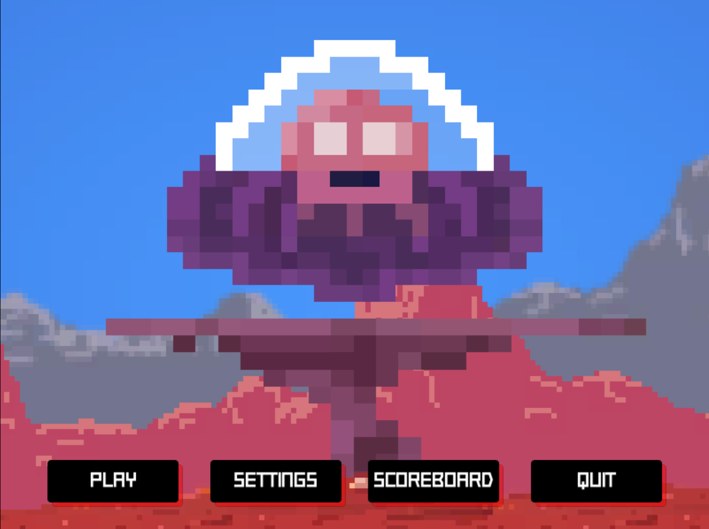


# Unity 2D Platformer-Zombie Wave Game
IF3210-2020-Unity-13517044  
By: Ignatius Timothy Manullang / 13517044  
## Deskripsi Aplikasi
Aplikasi ini merupakan aplikasi permainan yang dibuat dengan Unity.

Anda tiba-tiba berada di sebuah planet asing yang lokasi sebenarnya tidak kalian ketahui. Tiba-tiba terdapat banyak orang yang ingin mendekati anda. Akan tetapi, mengapa mereka terlihat seperti makhluk lain, anehnya mereka bisa menggunakan gravitasi yang rendah untuk terbang. Ternyata mereka ingin menyerang anda. Coba sebisa mungkin untuk bertahan hidup dan mengalahkan semua makhluk-makhluk lain yang ingin menyerang anda.

## Cara kerja
Secara default, aplikasi ini dapat dijalankan di Desktop dengan OS Windows dengan mengeksekusi executable file 2D-Platformer-Zombie-Wave-Game.exe

Dalam aplikasi ini terdapat 4 Scene, yaitu:

 - Scene Main Menu
	 - Pemenuhan spesifikasi k
	 - Menggunakan Canvas, Layout Panel, Button
	 - Ada beberapa asset dari Permainan yang static (tidak bergerak) sebagai dekorasi
 - Scene Permainan
	 - Pemenuhan spesifikasi a-j. More specifically:
		 - a - Player object
		 - b - Player Script di Player Object
		 - c - Weapon Script di Pistol Object yang merupakan Child of Arm Object yang merupakan Child of Player Object, dengan Audiomanager Script yang dihandle oleh Audiomanager object.
		 - d - Camera2DFollow Script di Camera Object 
		 - e -  Sprite Renderer di Graphics Object yang merupakan Child of Player Object
		 - f - 
			 - Enemy Generator - Spawnpoint yang merupakan Child of Camera Object agar SpawnPoint pasti diluar Camera, Wave Zombie dihandle dengan WaveSpawner Script di GameMaster Object. Spawn Enemy Object Prefab yang awalnya tidak ada di scene.
			 - Damage Player ketika Collide dengan Enemy - onCollisionEnter2D procedure di Enemy Script
		 - g - Value dan tampilan health dihandle di StatusIndicator Script, sprite terdapat di Status Indicator yang memiliki child berupa RectTransform yaitu HealthBar dan Text yaitu HealthText, value currentHealth dihandle 
		 - h - Asset dari 2D Standard Assets dari 2D Mega Pack, posisi dekorasi map diarrange oleh saya
		 - i - Score variable dihandle oleh GameMaster, seperated dari Player dan Enemy Object. Ketika Enemy Object Destroyed oleh KillEnemy maka Score akan diincrement. 
		 - j - Score Variable digunakan untuk kirim score ke basis data online. HTTP Post Request dihandle oleh SimplePostRequest function yang diakses oleh OnButtonSetScore function yang sebelumnya ditrigger oleh Button onClick(). Terdapat GameOver Screen yang tersedia untuk Retry, Quit ataupun input Username dan Button yang memiliki trigger onClick() yang sebelumnya dijelaskan untuk akses HTTP PostRequest. Username default adalah 13517044, tapi ketika input username baru, maka valuenya akan sesuai dengan username baru.
 - Scene Settings
	 - Pemenuhan spesifikasi l
	 - Menggunakan Canvas, Layout Panel, Button
	 - Settings menggunakan Dropdown (Resolution, Quality), Toggle (Fullscreen/Windowed , Enable/Disable Audio)
	 - Ada beberapa asset dari Permainan yang static (tidak bergerak) sebagai dekorasi
	 - Global variable sebagai bentuk PlayerPrefs, disimpan di SettingsManager
 - Scene Scoreboard
	 - 	Pemenuhan spesifikasi k
	 - Menggunakan Canvas, Layout Panel, Button
	 - Ada beberapa asset dari Permainan yang static (tidak bergerak) sebagai dekorasi
- Untuk pemenuhan Spesifikasi m, asset menggunakan 2D Standard Assets di 2D Mega Pack.
- Untuk pemenuhan Spesifikasi n, terdapat file-file unity pada repo agar bisa diakses di aplikasi dekstop. 

## How To Play
Untuk bergerak, gunakan W untuk lompat, A untuk bergerak ke kiri, S untuk bergerak ke kanan.

Untuk menembak, gunakan klik Mouse Button kiri.

Untuk mengarahkan tembakan, gunakan Cursor Mouse

Untuk mengalahkan musuh, tembak ke musuh sampai HP mereka habis. Setelah itu, anda akan mendapatkan 1 poin. Kumpulkan poin sebanyak-banyaknya untuk diupload ke Scoreboard Online!

Pemain akan mendapatkan damage jika musuh berhasil menyentuh pemain.

Jangan sampai jatuh ke jurang! Jurang akan langsung menghabiskan HP pemain.

Jika HP pemain habis, maka lives pemain akan berkurang 1. Jika lives pemain mencapai 0, Game Over!

## Library yang digunakan dan justifikasi penggunaannya
Library yang digunakan dalam Unity

 - UnityEngine 
	 - generating dynamic scoreboard GUI
	 - handling basic Unity types, classes and components such as:
		 - Random
		 - Audio (AudioClip, AudioSource)
		 - GameObject
		 - Transform
		 - Monobehavior
		 - Rigidbody2D
		 - Physics2D
		 - Collider2D
		 - Vectors (Vector2, Vector3)
		 - Animator
		 - RectTransform
		 - Camera
		 - Mathf
		 - Quaternion
		 - Input
		 - Time
	 - handling Debugging and Coroutines 
 - UnityEngine.SceneManagement - Scene Transition
 - System - Serializable class components
 - UnityEngine.Networking - GET and POST request to Server with API using UnityWebRequest.
 - System.Text - Handling Encoding of data received from Server
 - System.Collections - List, Array
 - System.Collections.Generic - Generic type handler for System.Collections
 - System.Linq - OrderByDescending scores for actual ranking in Scoreboard
 - UnityEngine.UI - handling UI components in script

Library eksternal yang digunakan adalah:

 - Astar [https://arongranberg.com/astar/](https://arongranberg.com/astar/) untuk pathfinding AI musuh mengikuti player
 - 2D Mega Pack [http://devassets.com/assets/2d-mega-pack/](http://devassets.com/assets/2d-mega-pack/) - Digunakan untuk aset 2D, termasuk sprite, sound

## Screenshot aplikasi
### Main Menu

### Game Scene
#### Start Game

#### Game Action

#### Update Scoreboard

#### Game Over

### Settings

### Scoreboard

## Acknowledgements

 - Thanks to Unity for Game Development Platform, Unity docs and Unity Forum 
 - Thanks to arongranberg for A Star 
 - Thanks to Brackeys for 2D Mega Pack & Guides 
 - Thanks to IF3210 Assistants and Lecturers
I apologize if mistakes were made when making this application, especially during COVID-19 isolation when I had a lot of other essential work to do in order to follow government's orders and survive.

